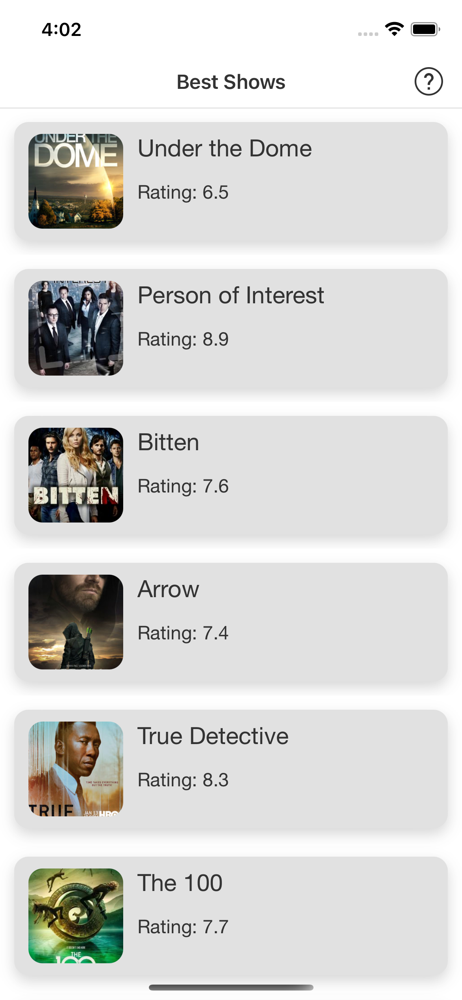
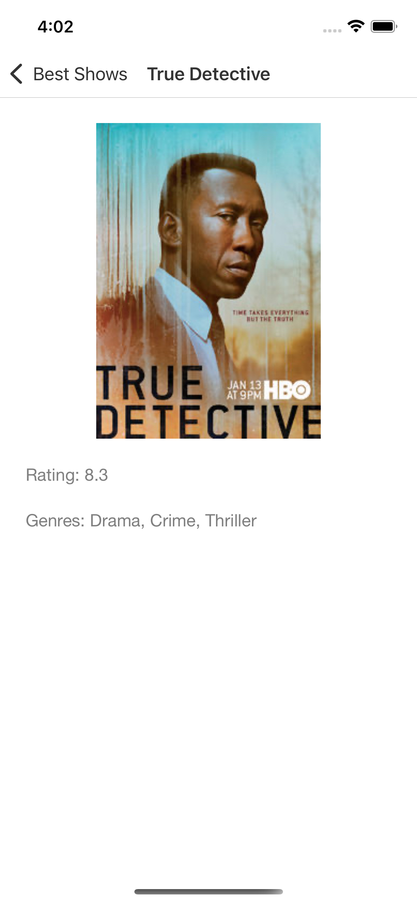

This app demonstrate the use of MVVM, RxSwift and Coordinators in order to create an app which is easy to maintinable and adding new features.

It is shown here how easy it is to manage the flow of the app with coordinators and also add deep link capabilities in the process.

The emphasis in the app is on architecture rather than on UI.

To run the project you need to have [cocoapods](https://cocoapods.org/) installed.
<br/>Simply run:
```
pod install
```


<br/><br/>

<p align="middle">
  
  
</p>
